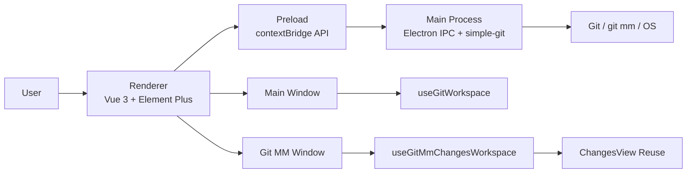
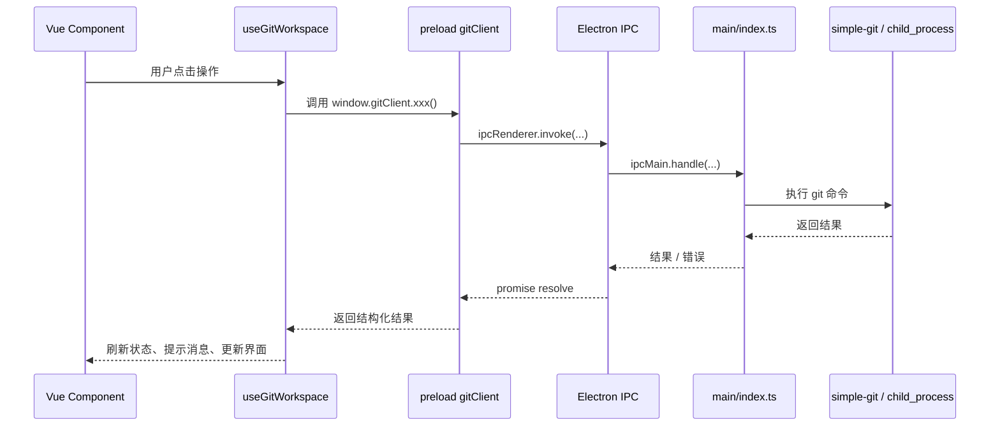
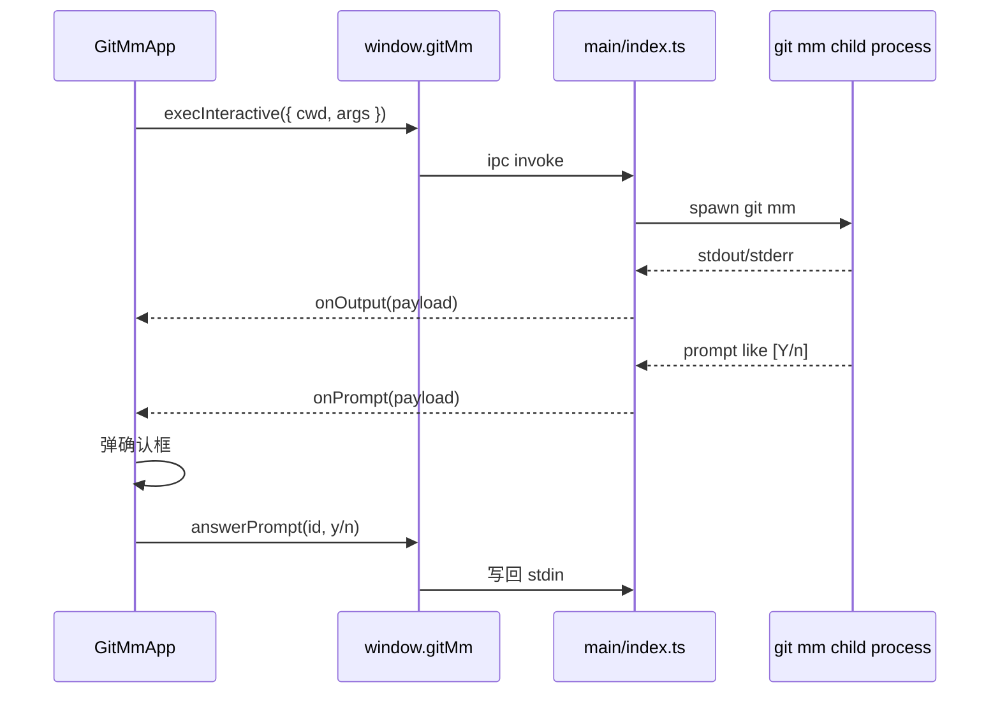

# git-gui

一个基于 `Electron + Vue 3 + TypeScript` 的桌面 Git 客户端，界面交互整体参考 Fork 类产品，同时补充了多仓标签、提交图、差异浏览、行级暂存、Git MM 多仓管理窗口等能力。

> 说明  
> - 产品名现统一为 `git-gui`。  
> - 仓库目录名目前仍为 `git-fork-like`，这是代码仓标识，不影响产品对外名称。  
> - 文中提到的 “Fork-like” 仅表示交互风格参考 Fork 类产品，不再作为产品名的一部分。  
> - 本文统一用“本项目”或 `git-gui` 指代该应用。

## 1. 项目概述

本项目的目标不是做一个只封装少量 Git 命令的简易 GUI，而是提供一套相对完整的桌面 Git 工作台：

- 面向日常单仓开发，提供主窗口工作流。
- 面向 `git mm` 多仓场景，提供独立的 Git MM Beta 窗口。
- 在保证 Electron 安全边界的前提下，把 Git、文件系统、窗口、终端、外部工具能力统一收敛到 IPC。
- 尽量复用 UI 组件与状态模型，避免主窗口与 Git MM 维护两套完全独立的“变更界面”。

项目当前具备以下特征：

- 自定义窗口外观，包含菜单、Ribbon、仓库标签栏、侧栏、主内容区。
- 主窗口支持多仓标签，并允许拖拽重排。
- Git MM 支持工作区标签和子仓标签拖拽重排。
- 主窗口和历史详情等主要左右 / 上下分栏支持拖拽调整比例。
- 差异浏览支持 `diff2html` 渲染、原始 diff 回退、上下文控制、忽略空白等。
- 支持提交、提交并推送、修订上次提交、最近提交消息回填、冲突处理、Mergetool、Stash、Worktree、Bisect、Rebase Todo、Apply Patch 等高级能力。
- 设置支持主题、语言、差异默认项、Git 默认行为以及常用 `git config` 编辑。
- Git MM 中支持 `init`、`sync`、`start`、`upload`、子仓切换、实时日志输出、交互式 `[Y/n]` 提示处理。

## 2. 产品定位与设计目标

### 2.1 面向的使用场景

- 想要一个比命令行更直观、比极简 Git GUI 更完整的桌面客户端。
- 需要同时操作多个仓库，并在标签间快速切换。
- 希望在“变更”与“历史”两个核心工作流之间高频切换。
- 需要在多仓工程中统一执行 `git mm` 命令，并按子仓查看状态与提交。

### 2.2 设计目标

- 交互清晰：主窗口按 `Changes / History` 两大视图组织，Git MM 作为独立窗口承载多仓场景。
- 能力集中：日常 Git 操作尽量直接在 GUI 中完成，必要时再跳转终端或外部工具。
- 安全分层：Renderer 不直接接触 Node / Git / 文件系统，只通过 preload 暴露的 API 调用。
- 可扩展：通过 typed IPC、集中状态管理和可复用组件，支撑后续继续扩展 Git 功能。
- 多窗口协同：Git MM 与主窗口既相互独立，又能通过“在主窗口打开此子仓”等能力互通。

## 3. 核心功能说明

### 3.1 主窗口能力概览

#### 3.1.1 仓库管理

- 打开本地仓库。
- 克隆远程仓库到指定目录。
- 同时打开多个仓库，显示为顶部标签。
- 仓库标签支持拖拽换序。
- 当前工作区记录保存在主进程托管的本地持久化文件中，不写入 Git 仓库本身。

#### 3.1.2 变更视图（Changes）

- 展示未暂存区与已暂存区。
- 以树形结构展示文件，并支持批量选择。
- 选中文件后在右侧显示差异。
- 支持暂存、取消暂存、还原工作区文件。
- 支持行级 / 选区级暂存、取消暂存、丢弃。
- 支持提交、提交并推送与“修订上次提交”。
- 提交主题框支持最近提交消息下拉回填。
- 支持冲突文件的 `ours` / `theirs` 快速写入。
- 支持调用外部 `mergetool`。
- 对二进制 diff 做检测，避免乱码直接显示。

#### 3.1.3 历史视图（History）

- 展示提交图与提交列表。
- 支持 grep / pickaxe / 正则 / ignore-case 等历史搜索。
- 支持加载更多提交。
- 查看某个提交的元信息、父提交、作者、提交说明。
- 查看该提交中某个文件的 diff。
- 查看该提交对应的完整文件树快照。
- 支持导出当前提交对应的完整工程快照 ZIP 包。
- 支持从提交节点直接触发 merge / rebase / cherry-pick / revert / reset 等操作。

#### 3.1.4 侧栏与高级 Git 能力

- 分支列表、远程、标签、Stash、子模块统一放在侧栏。
- 支持上游跟踪信息、ahead/behind 信息展示。
- 支持 Stash 列表与相关操作。
- 支持子模块查看、更新、同步与外部打开。
- 支持 Reflog、Worktree、Bisect、Rebase Todo 等高级对话框能力。
- 支持 Compare、Blame、文件历史、Apply Patch 等高级入口。

#### 3.1.5 外部工具、设置与系统集成

- 在资源管理器中打开仓库或路径。
- 在 Git 终端中打开仓库或路径。
- 打开浏览器中的 compare / PR 页面。
- 调用 Beyond Compare / WinMerge 等合并工具。
- 在“设置 -> Git”中配置 Git 默认远程、Pull / Push 默认行为、终端和合并工具。
- 在“设置 -> Git Config”中直接编辑常用全局 / 当前仓库 `git config`。

### 3.2 Git MM 窗口能力概览

Git MM 是一个单独窗口，用于管理多仓工作区，不占用主窗口当前仓库上下文。

#### 3.2.1 工作区管理

- 添加工作区根目录。
- 删除工作区记录。
- 工作区标签支持拖拽换位。
- 工作区切换时自动扫描子仓。
- 支持在资源管理器中打开工作区。

#### 3.2.2 `git mm` 命令流

- `git mm init`
- `git mm sync`
- `git mm start`
- `git mm upload`

支持能力包括：

- 输出实时流式展示。
- 交互式 `[Y/n]` 提示弹窗应答。
- 非零退出码时保留完整输出供判断。
- 长耗时操作时显示阻塞态，避免重复触发。

#### 3.2.3 子仓管理

- 扫描并列出工作区中的子仓。
- 子仓标签支持拖拽换位，并尽量在刷新后保持顺序。
- 子仓标签右键菜单支持“在主窗口打开此子仓”。
- 子仓面板中可执行状态刷新、分支切换、fetch、pull、push、stash、提交、提交并推送等操作。
- 子仓内复用了主窗口的 Changes 交互模型。

#### 3.2.4 Git MM 与主窗口联动

- 可从 Git MM 将子仓直接加载到主窗口。
- 主窗口与 Git MM 通过广播通道同步仓库状态变更。
- Git MM 中无法承载的高级能力，可切到主窗口继续处理。

### 3.3 功能矩阵

| 能力 | 主窗口 | Git MM |
|------|--------|--------|
| 多仓标签 | 支持 | 工作区标签 |
| 标签拖拽重排 | 支持 | 支持 |
| 变更视图 | 完整支持 | 子仓复用 |
| 历史提交图 | 完整支持 | 子仓历史面板 |
| 提交 / 提交并推送 / 修订上次提交 | 支持 | 支持 |
| 行级暂存 / 取消暂存 | 支持 | 支持 |
| Apply Patch（`.patch` / `.diff`） | 支持 | 通过主窗口承接 |
| Mergetool / 冲突处理 | 支持 | 支持 |
| Stash | 支持 | 支持 |
| Worktree / Reflog / Bisect / Rebase Todo | 支持 | 通过主窗口承接 |
| `git mm init/sync/start/upload` | 不负责 | 负责 |
| 子仓右键在主窗口打开 | 不适用 | 支持 |
| 实时子进程输出 | 部分 Git 操作 | 完整覆盖 `git mm` |

## 4. 快速开始

### 4.1 运行环境

建议准备以下环境：

- 已安装 Git，且命令行可直接执行 `git`。
- 若使用 Git MM，系统中还应可直接执行 `git mm`。
- Node.js 与 npm，用于本地开发、类型检查与打包。
- 若需使用外部合并工具，请安装 Beyond Compare 或 WinMerge 等工具。

### 4.2 本地开发

```bash
npm install
npm run dev
```

开发期常用命令：

```bash
npm run typecheck
npm run test
npm run test:unit
npm run test:functional
```

### 4.3 构建命令

```bash
npm run build
npm run build:git-mm
npm run build:no-git-mm
```

说明：

- `build`：标准构建，包含主窗口与 Git MM。
- `build:git-mm`：按 `git-mm-only` 模式构建 Git MM 专用前端资源，并进入打包流程。
- `build:no-git-mm`：构建不包含 Git MM 代码的主应用。

### 4.4 输出目录

- `dist/`：常规前端构建产物。
- `dist-electron/`：Electron main/preload 构建产物。
- `dist-git-mm/`：Git MM only 模式前端构建产物。
- `release/`：`electron-builder` 输出目录。

## 5. 使用说明

### 5.1 打开仓库与多标签

- 菜单中选择“打开仓库”或“克隆仓库”。
- 打开的仓库会进入顶部标签栏。
- 标签支持关闭、切换、拖拽排序。
- 工作区记录保存在本机应用数据目录下的持久化文件中，不会写入仓库。

### 5.2 变更视图工作流

推荐日常工作流如下：

1. 打开仓库。
2. 在左侧未暂存列表选择文件。
3. 在右侧查看 diff。
4. 执行暂存、部分暂存或恢复工作区。
5. 在底部填写提交主题和说明，必要时可从最近提交消息列表快速回填。
6. 如需修改上一个提交，勾选“修订上次提交”。
7. 根据需要直接提交，或在提交按钮下拉菜单中选择“提交并推送”。
8. 提交成功后刷新状态与历史。

额外说明：

- 勾选“修订上次提交”时，界面会先加载 `HEAD` 提交详情，再进入 amend 模式。
- 二进制文件不会被当作普通文本 diff 直接展示。
- 对冲突文件，可直接使用“我方 / 对方”写入工作区，再手工检查与暂存。
- 菜单“仓库 -> 应用补丁…”可从外部 `.patch` / `.diff` 文件执行一次 `git apply`。

### 5.3 历史视图工作流

历史视图不仅用于查看，还承担“从历史反向驱动操作”的职责：

- 浏览提交图与标签引用。
- 通过搜索缩小范围。
- 选中某个提交查看其元信息和文件。
- 在文件树标签中查看该提交对应的完整工程树。
- 直接导出该提交对应的完整工程快照 ZIP。
- 从提交上发起 merge、rebase、cherry-pick、revert、reset 等操作。

### 5.4 终端、资源管理器、浏览器与合并工具

#### 5.4.1 Git 终端

- 主窗口和子模块都支持“在 Git 命令行中打开”。
- 若设置中指定了终端路径，则优先使用该终端。
- 若未指定，则在系统上按内置策略尝试常见终端。

#### 5.4.2 资源管理器

- 可以直接在资源管理器中打开仓库根目录或相对路径。

#### 5.4.3 浏览器 Compare / PR

- 对于可识别的远程地址，支持构造 compare 页面并在浏览器中打开。

#### 5.4.4 合并工具

在“设置 -> Git”中可以配置：

- 跟随 Git 配置。
- Beyond Compare 4 / 3。
- WinMerge。
- 自定义工具路径。

冲突文件点击 `Mergetool` 时，会由主进程调用 `git mergetool`，并根据设置动态附加工具参数。

补充说明：

- 菜单“仓库 -> 应用补丁…”会读取外部 `.patch` / `.diff` 文件并执行 `git apply`。
- “设置 -> Git Config”可直接编辑常用全局 / 当前仓库 `git config` 覆盖项。

### 5.5 Git MM 工作流建议

推荐流程：

1. 打开 Git MM 窗口。
2. 添加工作区根目录。
3. 如有需要，执行 `git mm init`。
4. 执行 `git mm sync`，观察输出面板。
5. 执行 `git mm start <branch>` 或 `git mm upload`。
6. 在子仓标签中查看状态、提交、拉取、推送等。
7. 如果需要文件树、Blame、文件历史等更重的主窗口功能，可右键子仓标签，选择“在主窗口打开此子仓”。

## 6. 设计文档

### 6.1 总体架构



该架构的核心思想是：

- 界面逻辑放在 Renderer。
- 权限能力放在 Main Process。
- Renderer 通过 Preload 暴露的受控 API 访问主进程。
- 主窗口与 Git MM 共用一部分界面组件，但状态上下文可以不同。

### 6.2 分层职责

#### 6.2.1 Renderer 层

职责：

- 渲染界面。
- 管理状态。
- 组织交互流程。
- 处理本地 UI 逻辑、弹窗、表单、树形展示、差异渲染等。

代表模块：

- `src/App.vue`
- `src/components/*.vue`
- `src/git-mm/*.vue`
- `src/composables/useGitWorkspace.ts`
- `src/composables/useGitMmChangesWorkspace.ts`

#### 6.2.2 Preload 层

职责：

- 使用 `contextBridge` 向 Renderer 暴露最小可用 API。
- 将 Electron IPC 调用封装为带类型的客户端对象。

暴露的主要接口：

- `window.gitClient`
- `window.gitMm`
- `window.gitAt`
- `window.electronWindow`

#### 6.2.3 Main Process 层

职责：

- 创建主窗口与 Git MM 窗口。
- 统一处理 Git 命令、文件系统操作、对话框、外部终端、浏览器、资源管理器等。
- 维护 Git 子进程生命周期。
- 托管应用级持久化存储与兼容迁移。
- 作为多窗口的共享协调中心。

#### 6.2.4 Git / OS 层

职责：

- 实际执行 `git` / `git mm`。
- 打开系统对话框。
- 打开终端、资源管理器、浏览器。
- 调用外部合并工具。

### 6.3 入口与构建模式设计

#### 6.3.1 默认入口

默认入口是 `src/main.ts`：

- 若当前 hash 为 `#git-mm` 且启用了 Git MM，则挂载 `GitMmApp.vue`。
- 若当前 hash 为 `#git-mm` 但构建时禁用了 Git MM，则显示一个占位提示页。
- 其余情况下挂载主窗口 `App.vue`。

#### 6.3.2 Git MM only 入口

`src/main-git-mm.ts` 用于 Git MM 独立构建入口。

#### 6.3.3 Vite 构建模式

`vite.config.ts` 中有两类重要构建开关：

- `VITE_GIT_MM_ONLY=true`
- `VITE_ENABLE_GIT_MM=false`

对应效果：

- `git-mm-only`：只构建 Git MM 前端资源，输出到 `dist-git-mm/`。
- `no-git-mm`：主应用不包含 Git MM 相关代码。

### 6.4 主窗口前端设计

#### 6.4.1 顶层布局

主窗口由以下部分构成：

- 菜单栏 `AppMenuBar.vue`
- Ribbon `AppRibbon.vue`
- 仓库标签栏 `RepoTabsBar.vue`
- 左侧导航 `ForkSidebar.vue`
- 顶部头部 `AppHeader.vue`
- 主内容区 `ChangesView.vue` / `HistoryView.vue`
- 一组高级对话框

布局层面还做了以下约束：

- 主窗口和历史详情中的主要左右 / 上下分栏统一基于 `ResizableSplit`，支持拖拽调整比例。
- 内容较少时，文件树、差异区和提交详情也尽量铺满容器高度，避免出现大块空白。

#### 6.4.2 中心状态模型

主窗口以 `useGitWorkspace()` 作为中心状态容器。其特点：

- 使用模块级 `ref` / `computed` 管理大部分状态。
- 不是 Pinia，而是一个“大型单例 composable”。
- 首次使用时注册 watcher、window 生命周期、外部 repo 同步监听等逻辑。

这种设计的优点：

- 全局共享简单直接。
- 组件调用成本低。
- 主窗口内部通信方便。

代价：

- 文件体积大，耦合较高。
- 后续拆分和模块化难度相对更大。

### 6.5 Git MM 设计

#### 6.5.1 为什么 Git MM 独立成窗口

Git MM 面向的是一类不同于主窗口单仓工作的场景：

- 一个工作区根目录下有多个子仓。
- 用户关心的是整个多仓任务的批量命令执行。
- 命令往往耗时更长，更需要统一日志输出和阻塞态。

因此它被设计为单独的窗口，而不是主窗口中的一个 tab。

#### 6.5.2 Git MM Shell

`src/git-mm/GitMmApp.vue` 负责：

- 工作区列表与持久化。
- 子仓扫描与排序。
- `git mm` 命令工具栏。
- 输出面板。
- 子仓标签右键菜单。
- 与主窗口同步主题、语言和仓库状态。

#### 6.5.3 子仓视图复用

`MmSubRepoPanel.vue` 内部并没有重复造一套完整的“变更页面”，而是：

- 创建 `useGitMmChangesWorkspace()`。
- 通过 `changesWorkspaceInjection.ts` 的注入键把它提供给 `ChangesView.vue`。
- `ChangesView.vue` 在拿不到注入值时才回退到主窗口的 `useGitWorkspace()`。

这意味着：

- 主窗口与 Git MM 可以共享大部分变更视图 UI。
- Git MM 仍保留自己的仓库上下文与 Git API。

### 6.6 Git 操作数据流

以下是主窗口中一次典型 Git 操作的数据流：



Git MM 中的 `git mm upload` 等交互式命令还会多一层 prompt 流程：



### 6.7 差异、补丁与部分暂存设计

本项目在差异与部分暂存上做了几层设计：

- UI 层使用 `diff2html` 做富文本 diff 渲染。
- 无法可靠渲染时回退到原始文本 diff。
- 对二进制 diff 做显式检测。
- 行级暂存 / 取消暂存 / 丢弃并不是简单的 UI 标记，而是通过补丁生成和 patch apply 实现。
- 仓库菜单中的 Apply Patch 也复用了主进程侧的 `git apply` 管线，用于导入外部补丁文件。

关键实现方向包括：

- `diffLineRangePatch.ts`
- `partialLineMerge.ts`
- `splitUnifiedDiffHunks.ts`
- `binaryDiffDetect.ts`

设计目标是：

- 尽量只修改用户选中的变更范围。
- 尽量避免宽松匹配导致补丁套错位置。
- 失败时逐步放宽策略，而不是一开始就模糊应用。

### 6.8 提交快照树与导出设计

历史视图中的“文件树”不是简单的“本次提交改了哪些文件”的列表，而是：

- 基于 `git ls-tree -r --name-only <commit>` 获取该提交对应的完整树快照。
- 以目录树形式在界面中展示。
- 支持将该提交对应的完整工程内容导出为 ZIP 包。

也就是说：

- “变更文件”标签关注的是相对父提交的变更。
- “文件树”标签关注的是该提交时刻的完整工程树。

这是两种不同的数据视角。

### 6.9 状态同步与持久化设计

#### 6.9.1 本地持久化

本项目当前以“主进程托管的本地持久化文件”为主保存 UI 状态，并兼容历史数据迁移，例如：

- 主窗口工作区记录。
- 主题和语言设置。
- 历史视图性能设置。
- Git 默认行为设置。
- Git MM 工作区列表。
- Git MM 工作区 / 子仓标签顺序。
- Git MM `sync -j` 参数和 `start` 分支输入缓存。

其中 “设置 -> Git Config” 编辑的是 Git 自己的全局 / 仓库配置文件，不属于应用内部 UI 存储。

这些数据仅属于本机，不进入 Git 仓库。

#### 6.9.2 跨窗口同步

主窗口与 Git MM 通过 `BroadcastChannel` 和本地存储事件同步：

- 外观设置。
- 语言设置。
- 仓库状态变化广播。
- 主窗口外部强制切换仓库。

Git MM 选择“在主窗口打开此子仓”时，主进程会：

1. 把主窗口 repo 切到目标路径。
2. 激活并聚焦主窗口。
3. 通过事件通知主窗口刷新。

### 6.10 进程与资源管理设计

#### 6.10.1 主进程统一掌管 Git

所有真正的 Git 执行都放在主进程中，Renderer 不直接访问 Git。

这样做的好处：

- 安全边界更清晰。
- 统一错误处理。
- 便于对子进程做跟踪、超时、清理。

#### 6.10.2 托管 Git 子进程

主进程会跟踪由本应用启动的 Git 子进程，并在退出时尝试清理，避免：

- 仓库文件被占用。
- 窗口关闭后 Git 进程仍残留。
- Windows 下某些后代 `git.exe` 未退出导致的锁问题。

#### 6.10.3 Git MM 命令执行

Git MM 对 `git mm` 执行做了专门处理：

- 非交互命令与交互命令分流。
- 实时收集 stdout / stderr。
- 在 UI 中流式展示输出。
- 对交互确认进行识别并弹窗应答。
- 超时后杀死子进程，避免无限卡住。

### 6.11 多窗口对话框设计

主进程在弹出“打开目录”“选择可执行文件”“保存文件”等对话框时，会优先把对话框绑定到发起该操作的窗口，而不是一律绑定主窗口。

这样可以避免：

- 在 Git MM 中点按钮，却把主窗口激活出来。
- 多窗口场景下对话框归属错乱。

### 6.12 国际化与主题设计

#### 6.12.1 国际化

项目使用 `vue-i18n`，语言资源主要位于：

- `src/i18n/locales/zh-CN.json`
- `src/i18n/locales/en-US.json`
- `src/i18n/locales/extra.zh-CN.json`
- `src/i18n/locales/extra.en-US.json`
- `src/i18n/locales/dialogs-sidebar.*.json`

#### 6.12.2 主题

- 使用 Element Plus 明暗主题变量。
- 项目自有样式集中在 `src/styles/fork-app.css`。
- 主窗口与 Git MM 共享主题设置，并尽量在首帧前应用正确外观。

### 6.13 测试策略

当前测试以“工具函数和关键流程验证”为主：

- `src/utils/clonePathUtils.spec.ts`
- `src/utils/stashSidebarSelection.spec.ts`
- `src/utils/forkCommitGraphLayout.spec.ts`
- `src/utils/diffLineRangePatch.spec.ts`
- `src/utils/partialLineMerge.spec.ts`
- `tests/functional/git-workflows.functional.spec.ts`

测试策略特点：

- 优先覆盖高风险的纯函数和补丁生成逻辑。
- 用功能性测试验证关键 Git 工作流。
- 暂未采用大规模 Electron 端到端 UI 自动化。

## 7. 目录结构

```text
.
├─ electron/
│  ├─ main/index.ts                # Electron 主进程：窗口、IPC、Git、系统集成
│  └─ preload/index.ts             # contextBridge，向 renderer 暴露受控 API
├─ src/
│  ├─ App.vue                      # 主窗口壳层
│  ├─ main.ts                      # 默认入口，按 hash 决定挂载主窗口或 Git MM
│  ├─ main-git-mm.ts               # Git MM only 入口
│  ├─ styles/fork-app.css          # 全局样式与主题适配
│  ├─ components/
│  │  ├─ AppMenuBar.vue
│  │  ├─ AppRibbon.vue
│  │  ├─ RepoTabsBar.vue
│  │  ├─ ForkSidebar.vue
│  │  ├─ AppHeader.vue
│  │  ├─ ChangesView.vue
│  │  ├─ HistoryView.vue
│  │  ├─ HistoryGitgraph.vue
│  │  ├─ HunkStageDialog.vue
│  │  ├─ SyncDialogs.vue
│  │  ├─ AdvancedGitDialogs.vue
│  │  ├─ SettingsDialog.vue
│  │  ├─ CloneRepoDialog.vue
│  │  ├─ StashDetailDialog.vue
│  │  ├─ TagDeleteDialog.vue
│  │  └─ WelcomeView.vue
│  ├─ composables/
│  │  ├─ useGitWorkspace.ts        # 主窗口核心状态与操作
│  │  ├─ useGitMmChangesWorkspace.ts
│  │  ├─ changesWorkspaceInjection.ts
│  │  ├─ useDiff2HtmlCopyMenu.ts
│  │  └─ useDismissContextMenusOnOutside.ts
│  ├─ git-mm/
│  │  ├─ GitMmApp.vue
│  │  ├─ MmSubRepoPanel.vue
│  │  └─ MmDiffOptionsToolbar.vue
│  ├─ i18n/
│  │  ├─ index.ts
│  │  └─ locales/*.json
│  ├─ types/git-client.ts          # preload / renderer 共享类型定义
│  ├─ utils/                       # 纯工具、补丁处理、主题、存储、广播等
│  └─ constants/                   # 常量定义
├─ tests/
│  └─ functional/git-workflows.functional.spec.ts
├─ package.json
├─ vite.config.ts
└─ ReadMe.md
```

## 8. 关键模块速查表

| 文件 | 作用 |
|------|------|
| `electron/main/index.ts` | 主进程入口，负责窗口、IPC、Git 调用、系统对话框、外部工具、进程清理 |
| `electron/preload/index.ts` | 定义 `window.gitClient` / `window.gitMm` / `window.gitAt` / `window.electronWindow` |
| `src/App.vue` | 主窗口总装配 |
| `src/main.ts` | 根据 hash 与构建模式选择挂载主窗口或 Git MM |
| `src/composables/useGitWorkspace.ts` | 主窗口核心状态与行为 |
| `src/composables/useGitMmChangesWorkspace.ts` | Git MM 子仓的变更状态与行为 |
| `src/components/ChangesView.vue` | 变更视图核心组件 |
| `src/components/HistoryView.vue` | 历史视图核心组件 |
| `src/components/HistoryGitgraph.vue` | 提交图绘制与历史交互 |
| `src/git-mm/GitMmApp.vue` | Git MM 窗口壳层 |
| `src/git-mm/MmSubRepoPanel.vue` | Git MM 单个子仓面板 |
| `src/types/git-client.ts` | Renderer 侧核心类型契约 |
| `src/utils/partialLineMerge.ts` | 行级补丁与局部合并逻辑 |
| `src/utils/repoWorkspaceBroadcast.ts` | 主窗口与 Git MM 状态广播 |
| `src/utils/appSettingsStorage.ts` | 主题、语言、性能等设置的本地存储 |

## 9. 开发建议

如果你要继续扩展这个项目，建议优先遵循以下原则：

- 新的 Git / 系统能力优先加在主进程 IPC 层，不要直接进 Renderer。
- 若某个功能主窗口与 Git MM 都会用到，优先考虑复用组件与注入式状态适配。
- 对高风险的补丁、路径、排序、状态迁移逻辑优先补工具函数测试。
- 对大仓库场景要谨慎增加同步刷新、全量计算或大字符串处理。
- 若新增多窗口能力，要明确窗口归属、状态广播来源与对话框归属。

## 10. 常见问题

### 10.1 为什么有时主窗口和 Git MM 会同时存在

因为两者承担的是不同层级的工作：

- 主窗口偏单仓深度操作。
- Git MM 偏多仓批量操作与子仓管理。

### 10.2 为什么 Git MM 里还要提供“在主窗口打开此子仓”

因为主窗口拥有更完整的高级能力，例如：

- 文件树
- Blame
- 文件历史
- 更完整的高级对话框能力

Git MM 的目标不是替代主窗口，而是把多仓入口和批处理操作组织好。

### 10.3 工作区记录会不会污染仓库

不会。工作区记录、设置、Git MM 排序等都只保存在本机本应用的数据目录中，不会写入仓库。

### 10.4 大仓库或长历史为什么会感觉慢

这类应用天然会受到以下因素影响：

- `git status` / `git log` 规模
- diff 文本体积
- 提交图渲染
- 多窗口同步刷新

可以通过降低历史单次加载数量、减少不必要的同步刷新、按需查看详细 diff 来改善体验。

### 10.5 Git MM 为什么要求系统能执行 `git mm`

因为 Git MM 并不是内嵌了一套 manifest 管理实现，而是直接调用你机器上的 `git mm` 命令。

## 11. 许可证

项目当前 `package.json` 中声明为 `MIT`。

---

如果后续功能继续扩展，建议把本文当作“总览型文档”，同时在 `docs/` 下进一步拆分出：

- 用户手册
- 架构设计
- IPC 约定
- Git MM 专项设计
- 测试与发布流程

这样 README 可以保持入口清晰，细节文档可以继续纵向扩展。
